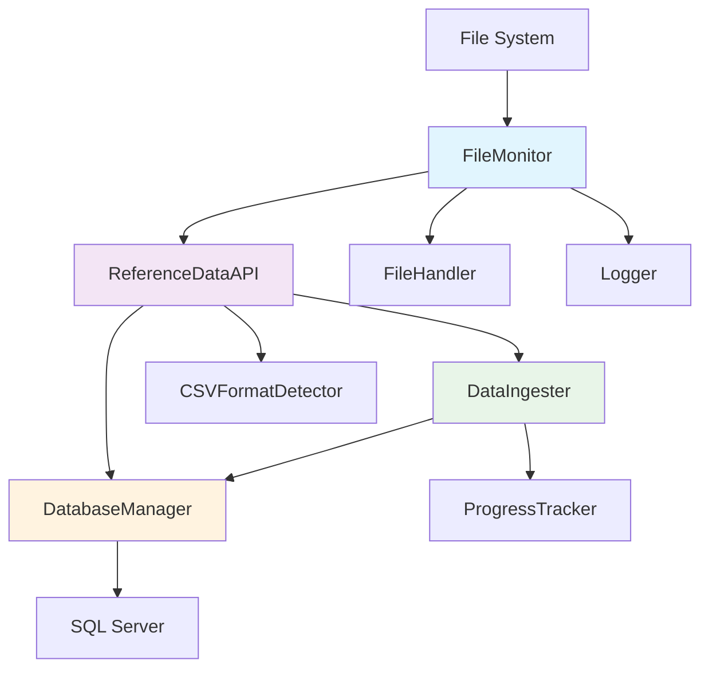

# Design Document

## Overview

The Reference Data Management System implements an enterprise-grade automated CSV processing architecture using a modular, event-driven design. The system orchestrates file monitoring, intelligent format detection, batch data processing, and comprehensive audit trails through loosely coupled components that communicate via well-defined interfaces. The architecture emphasizes reliability, scalability, and maintainability while providing real-time processing capabilities for enterprise data volumes.

## Steering Document Alignment

### Technical Standards (tech.md)
The design follows documented Python-based architecture patterns with asyncio for concurrent processing, SQL Server integration through pyodbc, and modular component design. Connection pooling, retry mechanisms, and transaction management align with enterprise database practices.

### Project Structure (structure.md)
Implementation follows the established backend/ structure with utils/ modules for shared functionality. The modular design separates concerns between file monitoring (file_monitor.py), API orchestration (backend_lib.py), and specialized utilities (database.py, ingest.py, csv_detector.py).

## Code Reuse Analysis

### Existing Components to Leverage
- **DatabaseManager (utils/database.py)**: Connection pooling, transaction management, and schema operations
- **DataIngester (utils/ingest.py)**: Batch processing engine with progress tracking and async generators
- **CSVFormatDetector (utils/csv_detector.py)**: Intelligent delimiter and header detection algorithms
- **FileHandler (utils/file_handler.py)**: Table name extraction and file operations
- **Logger (utils/logger.py)**: Multi-level logging infrastructure with audit trail support
- **Progress Utilities (utils/progress.py)**: Real-time progress tracking and cancellation mechanisms

### Integration Points
- **SQL Server Database**: Integrates with existing ref and bkp schemas for data storage and audit tracking
- **File System Structure**: Leverages established dropoff folder hierarchy with reference/non-reference classification
- **Environment Configuration**: Builds upon existing .env configuration management for database and processing parameters

## Architecture

The system employs a layered architecture with clear separation between monitoring, processing, and data access layers. The design uses the Observer pattern for file system monitoring, Strategy pattern for different processing modes, and Factory pattern for dynamic component creation.

### Modular Design Principles
- **Single File Responsibility**: FileMonitor handles only monitoring logic, DataIngester focuses solely on data processing
- **Component Isolation**: Each utility module (database, csv_detector, file_handler) operates independently with minimal coupling
- **Service Layer Separation**: Clear boundaries between data access (DatabaseManager), business logic (ReferenceDataAPI), and monitoring (FileMonitor)
- **Utility Modularity**: Specialized utilities for format detection, progress tracking, and file operations enable focused testing and reuse



## Components and Interfaces

### FileMonitor Component
- **Purpose:** Orchestrates file system monitoring and processing workflow coordination
- **Interfaces:** 
  - `scan_folders() -> List[Tuple[str, str, bool]]`: Discover CSV files with classification
  - `check_file_stability(file_path: str) -> bool`: Implement 6-check stability verification
  - `process_file(file_path, load_type, is_reference_data)`: Coordinate complete file processing
- **Dependencies:** ReferenceDataAPI, DatabaseManager, Logger
- **Reuses:** Leverages existing backend API for processing orchestration and database utilities for tracking

### ReferenceDataAPI Component
- **Purpose:** Unified interface providing all system operations with consistent response formatting
- **Interfaces:**
  - `detect_format(file_path: str) -> Dict[str, Any]`: CSV format detection and analysis
  - `process_file_sync/async(file_path, **kwargs)`: Synchronous and asynchronous processing
  - `analyze_schema_match(file_path, headers)`: Schema comparison against existing tables
  - `health_check() -> Dict[str, Any]`: System health verification
- **Dependencies:** DatabaseManager, DataIngester, CSVFormatDetector, FileHandler
- **Reuses:** Orchestrates existing utility components through dependency injection

### DataIngester Component
- **Purpose:** High-performance batch processing engine with progress tracking and transaction management
- **Interfaces:**
  - `async ingest_data(...) -> AsyncGenerator[str, None]`: Main processing pipeline with yield-based progress
  - Configurable batch size (default 990 rows), progress intervals, and memory management
- **Dependencies:** DatabaseManager, Logger, ProgressTracker
- **Reuses:** Builds upon existing database connection management and logging infrastructure

### DatabaseManager Component
- **Purpose:** Centralized database operations with connection pooling and retry logic
- **Interfaces:**
  - `get_connection() -> pyodbc.Connection`: Direct connection with retry and validation
  - `get_pooled_connection()`: Managed connection from pool
  - `ensure_schemas_exist()`, `table_exists()`, `get_table_columns()`: Schema management
- **Dependencies:** Environment configuration, pyodbc
- **Reuses:** Extends existing connection string building and environment variable management

### CSVFormatDetector Component
- **Purpose:** Intelligent format detection using scoring algorithms and pattern recognition
- **Interfaces:**
  - `detect_format(file_path) -> Dict[str, Any]`: Multi-stage detection with confidence scoring
  - Private methods for delimiter analysis, header detection, and encoding identification
- **Dependencies:** Standard libraries (csv, re, pathlib)
- **Reuses:** Standalone component with no external dependencies for maximum reusability

## Data Models

### File Tracking Model (ref.File_Monitor_Tracking)
```sql
CREATE TABLE [ref].[File_Monitor_Tracking] (
    id INT IDENTITY(1,1) PRIMARY KEY,
    file_path NVARCHAR(500) UNIQUE NOT NULL,
    file_name NVARCHAR(255),
    file_size BIGINT,
    file_hash NVARCHAR(64),           -- MD5 for duplicate detection
    load_type NVARCHAR(50),           -- 'fullload' or 'append'
    table_name NVARCHAR(255),
    detected_delimiter NVARCHAR(5),   -- CSV delimiter
    detected_headers NVARCHAR(MAX),   -- JSON array of headers
    is_reference_data BIT,            -- Reference data classification
    reference_config_inserted BIT DEFAULT 0,
    status NVARCHAR(50),              -- Processing status
    created_at DATETIME2 DEFAULT GETDATE(),
    processed_at DATETIME2,
    error_message NVARCHAR(MAX)
);
```

### Reference Data Configuration Model
```sql
CREATE TABLE [ref].[Reference_Data_Cfg] (
    id INT IDENTITY(1,1) PRIMARY KEY,
    table_name NVARCHAR(255) UNIQUE NOT NULL,
    created_at DATETIME2 DEFAULT GETDATE(),
    created_by NVARCHAR(100) DEFAULT 'AutoIngest',
    is_active BIT DEFAULT 1
);
```

### API Response Model
```python
{
    "success": bool,
    "data": Optional[Any],
    "error": Optional[str],
    "metadata": {
        "timestamp": str,
        "processing_time": float,
        "file_path": str,
        "operation": str
    }
}
```

## Error Handling

### Error Scenarios
1. **Database Connection Failures**
   - **Handling:** Exponential backoff retry with 3 attempts, connection pool failover
   - **User Impact:** Processing delayed but automatic recovery, detailed error logging

2. **File System Access Issues**
   - **Handling:** Permission validation, graceful degradation, alternative path resolution
   - **User Impact:** Files moved to error folder with clear error messages for resolution

3. **CSV Format Detection Failures**
   - **Handling:** Fallback detection algorithms, manual override capabilities, format assumption logging
   - **User Impact:** Processing continues with best-effort format detection, warnings logged

4. **Data Processing Errors**
   - **Handling:** Transaction rollback, batch-level error isolation, detailed error reporting
   - **User Impact:** File moved to error folder with specific error details for correction

5. **System Resource Exhaustion**
   - **Handling:** Memory monitoring, batch size adjustment, processing queue management
   - **User Impact:** Processing continues at reduced throughput, resource alerts generated

## Testing Strategy

### Unit Testing
- **DatabaseManager**: Connection pooling, retry logic, schema operations with mock database
- **CSVFormatDetector**: Format detection accuracy with diverse CSV samples and edge cases
- **DataIngester**: Batch processing, progress tracking, error handling with test data sets
- **FileHandler**: Table name extraction, file operations, naming convention compliance
- **FileMonitor**: Stability detection logic, file classification, monitoring loop behavior

### Integration Testing
- **End-to-End Processing**: Complete file lifecycle from dropoff to database insertion
- **Database Integration**: Real SQL Server operations with transaction management
- **Error Recovery**: Failure scenarios with automatic recovery validation
- **Performance Testing**: Large file processing, concurrent operations, resource utilization

### End-to-End Testing
- **Reference Data Workflow**: Complete processing of reference data files with configuration records
- **Non-Reference Data Workflow**: Processing without configuration generation
- **Multiple File Scenarios**: Concurrent processing of various file types and sizes
- **System Restart Recovery**: Processing resumption after system interruption