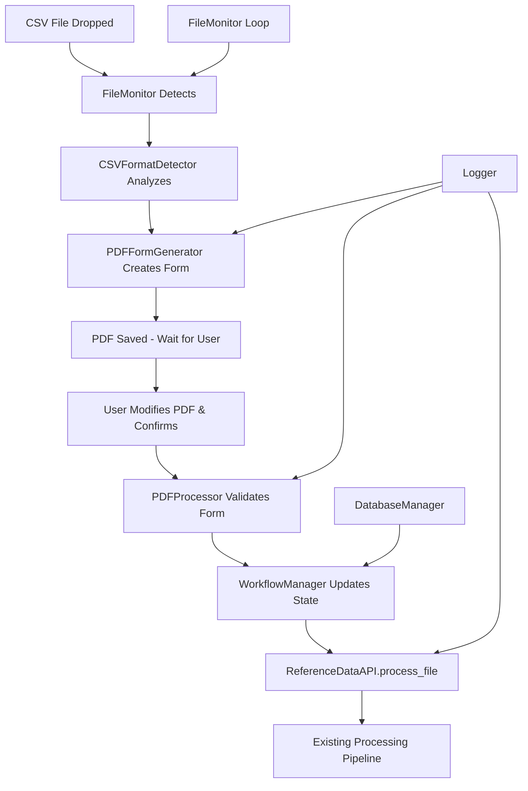

# Design Document

## Overview

The Simplified Dropoff System redesigns the current file monitoring architecture from fully automated processing to a human-in-the-loop validation workflow. The system will eliminate complex subfolder structures, introduce PDF-based configuration forms, and maintain compatibility with the existing processing engine (`ReferenceDataAPI`, `DataIngester`, database schemas).

The design leverages the existing `FileMonitor` pattern but replaces immediate processing with PDF generation and approval waiting, while reusing all existing utilities (`CSVFormatDetector`, `FileHandler`, `DatabaseManager`) and processing logic.

## Steering Document Alignment

### Technical Standards (tech.md)

The design follows established technical patterns:
- **Python 3.12+** with asyncio for PDF generation pipeline
- **Modular Design**: Separate PDF generation, form processing, and validation into focused utilities
- **Database Integration**: Preserves existing SQL Server connectivity and schema structure
- **Event-Driven Architecture**: Extends current file monitoring with PDF workflow states
- **Error Handling**: Maintains existing robust error handling with PDF-specific error paths

### Project Structure (structure.md)

Implementation follows project conventions:
- **Backend/Utils Organization**: New PDF utilities added to `backend/utils/` package
- **Naming Conventions**: `snake_case` for modules, `PascalCase` for classes (`PDFFormGenerator`, `PDFProcessor`)
- **Import Patterns**: Standard library → third-party → local utilities → local modules
- **Single Responsibility**: Each module handles one domain (PDF generation, form validation, workflow management)

## Code Reuse Analysis

### Existing Components to Leverage

- **FileMonitor (file_monitor.py)**: Extend existing file detection logic to trigger PDF generation instead of immediate processing
- **CSVFormatDetector (utils/csv_detector.py)**: Reuse complete format detection logic to populate PDF forms
- **ReferenceDataAPI (backend_lib.py)**: Maintain existing `process_file()` method as final processing step
- **DatabaseManager (utils/database.py)**: Use existing SQL Server connectivity for audit trails and state tracking
- **Logger (utils/logger.py)**: Extend logging to include PDF generation and validation events
- **FileHandler (utils/file_handler.py)**: Reuse file movement and archival logic after processing

### Integration Points

- **Existing File Monitor Loop**: Modify `FileMonitor.scan_directories()` to call PDF generation instead of processing
- **Backend API Processing**: Call `ReferenceDataAPI.process_file()` after PDF approval with user-specified parameters
- **Database Schema**: Add new tracking table for PDF workflow states while preserving `ref.File_Monitor_Tracking`
- **Logging Infrastructure**: Integrate PDF workflow events into existing audit trail system

## Architecture

The system uses a **State Machine Pattern** for PDF workflow management combined with the existing **Observer Pattern** for file monitoring. The architecture introduces PDF generation as an intermediate step between file detection and processing, while maintaining all existing processing components unchanged.

### Modular Design Principles
- **Single File Responsibility**: `pdf_generator.py` handles form creation, `pdf_processor.py` handles form validation, `workflow_manager.py` orchestrates states
- **Component Isolation**: PDF components operate independently and can be tested/modified without affecting existing processing logic
- **Service Layer Separation**: Clear separation between file detection, PDF workflow, and data processing layers
- **Utility Modularity**: PDF utilities are focused, single-purpose modules that integrate cleanly with existing backend utilities



## Components and Interfaces

### PDFFormGenerator
- **Purpose:** Creates interactive PDF configuration forms from CSV analysis results
- **Interfaces:** 
  - `generate_form(csv_path: str, format_data: Dict) -> str` - Returns PDF file path
  - `populate_form_fields(detection_data: Dict) -> Dict` - Maps CSV analysis to form fields
- **Dependencies:** CSVFormatDetector, reportlab or fpdf library, FileHandler for path management
- **Reuses:** Extends existing CSV format detection output, follows existing file naming conventions from FileHandler

### PDFProcessor
- **Purpose:** Validates and extracts configuration from completed PDF forms
- **Interfaces:**
  - `validate_form(pdf_path: str) -> Tuple[bool, Dict, List[str]]` - Returns (is_valid, config_data, errors)
  - `extract_configuration(pdf_path: str) -> Dict` - Extracts user selections from PDF
- **Dependencies:** PyPDF2 or pdfplumber for form reading, existing validation utilities
- **Reuses:** Leverages existing validation patterns from DataIngester, integrates with Logger for error tracking

### WorkflowManager  
- **Purpose:** Orchestrates PDF workflow states and coordinates with existing processing pipeline
- **Interfaces:**
  - `create_workflow(csv_path: str) -> str` - Creates new workflow, returns workflow_id
  - `update_status(workflow_id: str, status: str) -> bool` - Updates workflow state
  - `process_approved_file(workflow_id: str, pdf_config: Dict) -> bool` - Triggers actual processing
- **Dependencies:** DatabaseManager for state persistence, ReferenceDataAPI for processing
- **Reuses:** Extends existing FileMonitor tracking patterns, integrates with existing process_file method

### SimplifiedFileMonitor
- **Purpose:** Modified version of FileMonitor that triggers PDF generation instead of immediate processing
- **Interfaces:**
  - `scan_simplified_directory() -> List[str]` - Scans single dropoff directory
  - `handle_new_file(csv_path: str) -> str` - Creates PDF workflow for new files
- **Dependencies:** All existing FileMonitor dependencies plus PDFFormGenerator, WorkflowManager
- **Reuses:** 90% of existing FileMonitor logic, only changes processing trigger and directory structure

## Data Models

### PDFWorkflow
```python
# Database table: ref.PDF_Workflow_Tracking
{
    "workflow_id": "uuid string",           # Unique workflow identifier
    "csv_file_path": "string",              # Original CSV file path
    "pdf_file_path": "string",              # Generated PDF form path
    "status": "enum",                       # pending_pdf, pdf_generated, user_reviewing, approved, processing, completed, error
    "created_at": "datetime",               # Workflow creation timestamp
    "pdf_generated_at": "datetime",         # PDF form creation timestamp
    "approved_at": "datetime",              # User approval timestamp
    "completed_at": "datetime",             # Processing completion timestamp
    "error_message": "string optional",    # Error details if status=error
    "user_config": "json",                  # User-specified processing configuration
}
```

### PDFFormConfiguration
```python
# Configuration extracted from PDF forms
{
    "delimiter": "string",                  # CSV delimiter character
    "encoding": "string",                   # File encoding
    "has_headers": "boolean",               # Header row presence
    "processing_mode": "enum",              # fullload | append
    "is_reference_data": "boolean",         # Create config record yes/no
    "table_name": "string",                 # Derived from filename
    "confirmed": "boolean",                 # Final confirmation checkbox
}
```

### WorkflowState
```python
# In-memory workflow tracking
{
    "workflow_id": "string",
    "csv_path": "string", 
    "pdf_path": "string",
    "current_status": "string",
    "format_detection": "dict",             # CSVFormatDetector output
    "last_checked": "datetime",             # Last PDF modification check
    "retry_count": "int",                   # Error retry counter
}
```

## Error Handling

### Error Scenarios

1. **PDF Generation Failure**
   - **Handling:** Log error, mark workflow as error status, retry PDF generation with default values, notify via log
   - **User Impact:** User sees error log entry, PDF may have default values with error notice, workflow can still proceed

2. **PDF Form Validation Error**  
   - **Handling:** Extract partial configuration, validate each field individually, return specific error messages for invalid selections
   - **User Impact:** User sees validation warnings in logs, processing blocked until PDF is corrected and re-saved

3. **User Configuration Conflicts**
   - **Handling:** PDF form includes client-side validation warnings, server-side validation catches conflicts, clear error messages provided
   - **User Impact:** User sees visual warnings in PDF form, clear guidance on how to resolve conflicts

4. **PDF File Access/Permission Issues**
   - **Handling:** Check file permissions during generation and reading, fallback to basic text-based configuration file, log permission issues
   - **User Impact:** System may fall back to text configuration file instead of PDF, processing can still proceed with manual configuration

5. **Existing Processing Engine Errors**
   - **Handling:** All existing error handling from ReferenceDataAPI preserved unchanged, errors logged with workflow context
   - **User Impact:** Same error experience as current system, with additional workflow ID for traceability

## Testing Strategy

### Unit Testing

- **PDFFormGenerator**: Test PDF creation with various CSV formats, validate form field population, test error handling for corrupt CSV files
- **PDFProcessor**: Test form validation logic, configuration extraction accuracy, error message clarity and actionable guidance
- **WorkflowManager**: Test state transitions, database persistence, integration with existing processing API
- **SimplifiedFileMonitor**: Test directory scanning changes, PDF workflow initiation, compatibility with existing monitoring logic

### Integration Testing

- **End-to-End PDF Workflow**: CSV detection → PDF generation → user modification → validation → processing
- **Database Integration**: Workflow state persistence, compatibility with existing tracking tables, audit trail completeness
- **File System Operations**: PDF file creation/reading permissions, CSV file handling, existing archive/cleanup processes
- **Backward Compatibility**: Ensure existing ReferenceDataAPI.process_file() works unchanged with new configuration sources

### End-to-End Testing

- **Complete User Scenarios**: 
  - Drop CSV → Review PDF → Approve → Verify data processed correctly
  - Drop CSV → Review PDF → Modify settings → Approve → Verify custom processing
  - Drop CSV → PDF generation fails → System recovery → Alternative processing path
- **Performance Testing**: PDF generation time within 30 seconds, large file handling (100MB+), concurrent workflow management
- **Error Recovery Testing**: System behavior during PDF corruption, user permission issues, processing failures with workflow cleanup