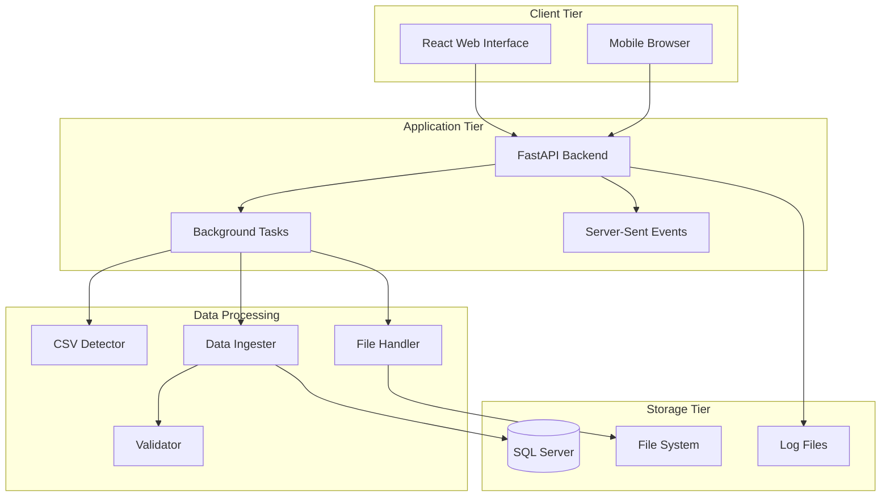
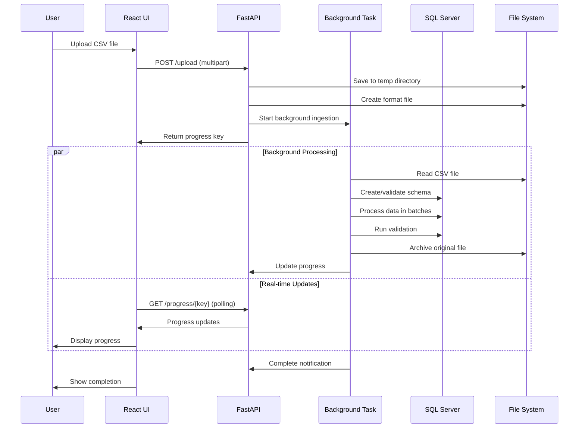

# System Architecture Documentation

## Overview

The Reference Data Auto Ingest System is a modern, scalable web application built with a multi-tier architecture. It provides automated CSV data ingestion capabilities with real-time progress tracking, comprehensive validation, and enterprise-grade security features.

## High-Level Architecture



## Component Architecture

### Frontend Tier (React)

#### Technology Stack
- **React 18.x** - Modern React with hooks and concurrent features
- **Material-UI 5.x** - Enterprise-grade UI component library
- **Axios** - HTTP client for API communication
- **Create React App** - Build toolchain and development environment

#### Component Structure
```
src/
├── App.js                          # Main application component
├── components/
│   ├── FileUploadComponent.js      # Drag & drop file upload
│   ├── ConfigurationPanel.js       # CSV format configuration
│   ├── ProgressDisplay.js          # Real-time progress monitoring
│   └── LogsDisplay.js              # System logs viewer
└── index.js                        # Application entry point
```

#### Key Features
- **Responsive Design**: Material-UI responsive grid system
- **Real-time Updates**: Server-Sent Events for progress streaming
- **Progressive Enhancement**: Works on mobile and desktop
- **Error Handling**: User-friendly error display with technical details
- **Auto-refresh**: Automatic log refresh with configurable intervals

#### State Management
```javascript
// Component state management with React hooks
const [uploadState, setUploadState] = useState({
  file: null,
  progress: 0,
  status: 'idle', // idle, uploading, processing, complete, error
  logs: [],
  config: {}
});

// Real-time progress via Server-Sent Events
useEffect(() => {
  const eventSource = new EventSource(`/ingest/${filename}`);
  eventSource.onmessage = (event) => {
    setUploadState(prev => ({
      ...prev,
      progress: parseProgress(event.data)
    }));
  };
}, [filename]);
```

### Backend Tier (FastAPI)

#### Technology Stack
- **FastAPI** - Modern async web framework with automatic OpenAPI
- **Uvicorn** - High-performance ASGI server
- **Pydantic** - Data validation using Python type annotations
- **python-multipart** - Multipart form data handling
- **aiofiles** - Async file operations

#### Core Architecture
```python
# Main FastAPI application structure
app = FastAPI(
    title="Reference Data Auto Ingest System",
    description="Automated reference data ingestion from CSV files to SQL Server",
    version="1.0.0"
)

# Middleware stack
app.add_middleware(CORSMiddleware, ...)  # CORS handling
# Custom error handling middleware
# Request logging middleware
# Security headers middleware
```

#### Endpoint Categories

##### System Endpoints
- `GET /` - Health check and system status
- `GET /config` - System configuration
- `GET /features` - Feature flags and capabilities

##### File Processing Endpoints  
- `POST /detect-format` - Auto-detect CSV format
- `POST /upload` - File upload with background processing
- `POST /ingest/{filename}` - Stream ingestion progress
- `GET /progress/{key}` - Progress status polling

##### Database Endpoints
- `GET /schema/{table_name}` - Table schema information
- `GET /db/pool-stats` - Connection pool statistics

##### Monitoring Endpoints
- `GET /logs` - System logs with no-cache headers

#### Async Processing Model
```python
# Background task processing
@app.post("/upload")
async def upload_file(background_tasks: BackgroundTasks, ...):
    # Immediate file validation and save
    temp_path = await file_handler.save_uploaded_file(file, ...)
    
    # Start background ingestion
    background_tasks.add_task(
        ingest_data_background,
        temp_path, fmt_path, load_mode, filename
    )
    
    return {"status": "processing", "progress_key": key}

# Server-Sent Events for real-time progress
async def ingest_data_stream(...):
    async for progress in ingester.ingest_data(...):
        yield f"data: {progress}\n\n"
```

### Data Processing Layer

#### CSV Format Detection
```python
class CSVFormatDetector:
    """Intelligent CSV format detection with confidence scoring"""
    
    def detect_format(self, file_path: str) -> Dict[str, Any]:
        """
        Analyze CSV file to detect:
        - Column delimiter (, ; | \t)
        - Row delimiter (\r \n \r\n custom)
        - Text qualifier (" ' "")
        - Header presence
        - Trailer patterns
        - Encoding detection
        """
        
        # Multi-stage detection algorithm
        sample_data = self._read_sample(file_path)
        
        # Delimiter detection with frequency analysis
        delimiters = self._detect_delimiters(sample_data)
        
        # Header/trailer pattern recognition
        structure = self._analyze_structure(sample_data)
        
        # Confidence scoring
        confidence = self._calculate_confidence(delimiters, structure)
        
        return {
            "column_delimiter": delimiters["column"],
            "row_delimiter": delimiters["row"], 
            "text_qualifier": delimiters["text"],
            "has_header": structure["has_header"],
            "has_trailer": structure["has_trailer"],
            "trailer_pattern": structure["trailer_pattern"],
            "confidence": confidence,
            "sample_data": sample_data[:3]
        }
```

#### Data Ingestion Pipeline
```python
class DataIngester:
    """Main data ingestion orchestrator"""
    
    async def ingest_data(self, file_path, fmt_path, load_mode, filename):
        """
        Complete ingestion pipeline:
        1. File format parsing
        2. Table schema creation/validation
        3. Data type inference (optional)
        4. Batch data loading
        5. Validation execution
        6. Archive and cleanup
        """
        
        # Progress tracking initialization
        progress_key = self._sanitize_progress_key(filename)
        prog.init_progress(progress_key)
        
        try:
            # Stage 1: Parse CSV format
            yield "Reading format configuration..."
            format_config = await self.file_handler.read_format_file(fmt_path)
            
            # Stage 2: Database preparation
            yield "Preparing database schema..."
            await self._prepare_database_schema(table_name, load_mode)
            
            # Stage 3: Data processing
            yield "Processing CSV data..."
            async for batch_progress in self._process_csv_batches(file_path, format_config):
                yield batch_progress
            
            # Stage 4: Validation
            yield "Running data validation..."
            validation_result = await self._run_validation(table_name)
            
            # Stage 5: Finalization
            yield "Finalizing ingestion..."
            await self._finalize_ingestion(file_path, table_name, load_mode)
            
            yield "Ingestion completed successfully"
            
        except Exception as e:
            yield f"ERROR: {str(e)}"
            raise
```

#### Database Schema Management
```python
class DatabaseManager:
    """Database operations with security hardening"""
    
    def ensure_table_schema(self, table_name: str, columns: List[Dict]) -> None:
        """
        Create or update table schema:
        - Main table: [data_schema].[table_name]
        - Stage table: [data_schema].[table_name_stage]  
        - Backup table: [backup_schema].[table_name_backup]
        """
        
        # Parameterized DDL generation
        main_table_sql = self._generate_table_ddl(
            schema=self.data_schema,
            table=table_name, 
            columns=columns,
            include_load_time=True
        )
        
        stage_table_sql = self._generate_table_ddl(
            schema=self.data_schema,
            table=f"{table_name}_stage",
            columns=columns
        )
        
        backup_table_sql = self._generate_table_ddl(
            schema=self.backup_schema,
            table=f"{table_name}_backup", 
            columns=columns + [{"name": "version_id", "type": "int"}]
        )
        
        # Execute with proper error handling
        conn = self.get_connection()
        try:
            conn.execute(main_table_sql)
            conn.execute(stage_table_sql)  
            conn.execute(backup_table_sql)
            conn.commit()
        except Exception as e:
            conn.rollback()
            raise e
        finally:
            conn.close()
```

### Database Tier Architecture

#### Schema Design

```sql
-- Multi-schema approach for data organization
USE [reference_data_db];

-- Main data schema
CREATE SCHEMA [ref];  -- Production tables and stored procedures
CREATE SCHEMA [bkp];  -- Backup tables with versioning

-- Table structure pattern
CREATE TABLE [ref].[{table_name}] (
    -- User data columns (all varchar for flexibility)
    [column_1] varchar(4000),
    [column_2] varchar(4000),
    [column_n] varchar(4000),
    
    -- System columns
    [ref_data_loadtime] datetime DEFAULT GETDATE()
);

-- Stage table for validation
CREATE TABLE [ref].[{table_name}_stage] (
    -- Identical structure to main table
    -- Used for data validation before promotion
);

-- Backup table with versioning
CREATE TABLE [bkp].[{table_name}_backup] (
    -- Main table structure plus versioning
    [version_id] int NOT NULL,
    [backup_timestamp] datetime DEFAULT GETDATE()
);

-- Validation stored procedures
CREATE PROCEDURE [ref].[sp_ref_validate_{table_name}]
AS
BEGIN
    -- Custom validation logic (configurable)
    -- Returns JSON validation results
    SELECT '{"validation_result": 0, "validation_issue_list": []}' AS ValidationResult;
END
```

#### Connection Management
```python
class DatabaseManager:
    """Database connection management with pooling"""
    
    def __init__(self):
        # Connection pool configuration
        self.pool_size = int(os.getenv("DB_POOL_SIZE", "5"))
        self._pool: List[pyodbc.Connection] = []
        self._pool_lock = threading.Lock()
        self._in_use = 0
        
        # Retry configuration
        self.max_retries = int(os.getenv("DB_MAX_RETRIES", "3"))
        self.retry_backoff = float(os.getenv("DB_RETRY_BACKOFF", "0.5"))
    
    def get_connection(self) -> pyodbc.Connection:
        """Get connection with retry logic"""
        attempt = 0
        while True:
            try:
                connection = pyodbc.connect(self.connection_string)
                connection.autocommit = True
                return connection
            except Exception as e:
                attempt += 1
                if attempt >= self.max_retries:
                    raise e
                time.sleep(self.retry_backoff * attempt)
```

### File System Architecture

#### Directory Structure
```
C:\data\reference_data\
├── temp\                   # Temporary processing files
│   ├── timestamp_filename.csv
│   └── ...
├── archive\               # Processed file archive
│   ├── filename_timestamp.csv
│   └── ...
├── format\               # Format configuration files
│   ├── timestamp_filename.fmt
│   └── ...
└── logs\                 # System logs (optional file logging)
    ├── system.log
    └── error.log
```

#### File Handling Security
```python
class FileHandler:
    """Secure file operations with path validation"""
    
    def get_safe_path(self, base_dir: str, filename: str) -> str:
        """Generate safe file path within base directory"""
        # Sanitize filename
        safe_name = os.path.basename(filename)
        safe_name = re.sub(r'[^\w\.-]', '_', safe_name)
        
        # Construct path within base directory
        safe_path = os.path.join(base_dir, safe_name)
        
        # Validate path is within base directory (prevent traversal)
        if not os.path.commonpath([safe_path, base_dir]) == base_dir:
            raise ValueError("Invalid file path")
        
        return safe_path
    
    async def save_uploaded_file(self, file: UploadFile, ...) -> Tuple[str, str]:
        """Save uploaded file with format configuration"""
        timestamp = datetime.now().strftime("%Y%m%d_%H%M%S")
        base_name = self.extract_table_base_name(file.filename)
        
        # Generate timestamped filenames
        temp_filename = f"{timestamp}_{base_name}.csv"
        fmt_filename = f"{timestamp}_{base_name}.fmt"
        
        # Save files securely
        temp_path = self.get_safe_path(self.temp_location, temp_filename)
        fmt_path = self.get_safe_path(self.format_location, fmt_filename)
        
        # Write file content
        async with aiofiles.open(temp_path, 'wb') as f:
            content = await file.read()
            await f.write(content)
        
        # Write format configuration
        format_config = self.build_format_config(...)
        async with aiofiles.open(fmt_path, 'w') as f:
            await f.write(json.dumps(format_config, indent=2))
        
        return temp_path, fmt_path
```

## Data Flow Architecture

### Upload and Processing Flow



### Data Processing Pipeline


## Security Architecture

### Security Layers

#### 1. Application Security Layer
```python
# Input validation and sanitization
def validate_input(user_input: str, input_type: str) -> str:
    """Comprehensive input validation"""
    if input_type == "sql_identifier":
        if not re.match(r'^[a-zA-Z_][a-zA-Z0-9_]*$', user_input):
            raise ValueError("Invalid SQL identifier")
    
    if input_type == "filename":
        safe_name = os.path.basename(user_input)
        safe_name = re.sub(r'[^\w\.-]', '_', safe_name)
        return safe_name
    
    return user_input

# SQL injection prevention
def execute_parameterized_query(cursor, sql: str, params: tuple):
    """All database operations use parameterized queries"""
    cursor.execute(sql, params)
```

#### 2. Database Security Layer
```python
# Connection security
connection_string = (
    f"DRIVER={{ODBC Driver 17 for SQL Server}};"
    f"SERVER={host};"
    f"DATABASE={database};"
    f"UID={username};"
    f"PWD={password};"
    f"TrustServerCertificate=yes;"
    f"Encrypt=yes;"  # Force encryption
)

# Schema-based access control
def ensure_schema_permissions(schema_name: str):
    """Verify user permissions on specific schema"""
    permissions = [
        "SELECT", "INSERT", "UPDATE", "DELETE",
        "CREATE TABLE", "ALTER TABLE", "EXECUTE"
    ]
    # Verify each permission before operations
```

#### 3. File System Security Layer
```python
# File access controls
def validate_file_access(file_path: str, operation: str):
    """Ensure file operations are within allowed directories"""
    allowed_dirs = [
        os.getenv("temp_location"),
        os.getenv("archive_location"),
        os.getenv("format_location")
    ]
    
    resolved_path = os.path.abspath(file_path)
    if not any(resolved_path.startswith(dir) for dir in allowed_dirs):
        raise PermissionError("File access denied")
```

## Performance Architecture

### Async Processing Model

#### FastAPI Async Benefits
```python
# Non-blocking I/O operations
async def upload_file(file: UploadFile):
    """Non-blocking file upload handling"""
    # File I/O doesn't block other requests
    content = await file.read()  # async file reading
    
    # Database operations can be made async
    async with async_database_session() as session:
        await session.execute(query)
        await session.commit()
```

#### Background Task Processing
```python
# Background processing prevents request blocking
@app.post("/upload")
async def upload_file(background_tasks: BackgroundTasks):
    # Immediate response to user
    background_tasks.add_task(heavy_processing_task, file_data)
    return {"status": "processing"}

# Heavy processing happens in background
async def heavy_processing_task(file_data):
    """CPU-intensive work doesn't block API responses"""
    await process_large_csv_file(file_data)
```

### Database Performance

#### Connection Pooling
```python
class ConnectionPool:
    """Database connection pool for performance"""
    
    def __init__(self, pool_size=5):
        self._pool = []
        self._lock = threading.Lock()
        self.pool_size = pool_size
    
    def get_connection(self):
        """Reuse existing connections when available"""
        with self._lock:
            if self._pool:
                return self._pool.pop()
            else:
                return self._create_new_connection()
    
    def return_connection(self, conn):
        """Return connection to pool for reuse"""
        with self._lock:
            if len(self._pool) < self.pool_size:
                self._pool.append(conn)
            else:
                conn.close()
```

#### Batch Processing
```python
def batch_insert_data(data: List[List], batch_size=990):
    """Multi-row INSERT for performance"""
    # Process data in batches to optimize SQL Server performance
    for i in range(0, len(data), batch_size):
        batch = data[i:i+batch_size]
        
        # Multi-row VALUES clause
        placeholders = ','.join(['(?' + ',?' * (len(batch[0])-1) + ')'] * len(batch))
        sql = f"INSERT INTO table_name VALUES {placeholders}"
        
        # Flatten batch data for parameterized query
        flat_values = [item for row in batch for item in row]
        cursor.execute(sql, flat_values)
```

### Memory Management

#### Streaming Data Processing
```python
async def process_large_csv(file_path: str):
    """Process large files without loading entirely into memory"""
    chunk_size = int(os.getenv("CSV_CHUNK_SIZE", "10000"))
    
    async with aiofiles.open(file_path, 'r') as file:
        chunk = []
        async for line in file:
            chunk.append(line)
            
            if len(chunk) >= chunk_size:
                await process_chunk(chunk)
                chunk = []  # Clear memory
                
        # Process remaining chunk
        if chunk:
            await process_chunk(chunk)
```

## Scalability Architecture

### Horizontal Scaling Considerations

#### Stateless Application Design
```python
# Progress tracking can be moved to external store for scaling
class ExternalProgressTracker:
    """Redis-based progress tracking for multi-instance deployment"""
    
    def __init__(self, redis_client):
        self.redis = redis_client
    
    def update_progress(self, key: str, progress_data: dict):
        """Store progress in Redis for multi-instance access"""
        self.redis.setex(
            f"progress:{key}", 
            3600,  # 1 hour TTL
            json.dumps(progress_data)
        )
```

#### Database Scaling
```python
# Connection string for read replicas
class ScalableDatabase:
    """Database with read/write separation"""
    
    def __init__(self):
        self.write_conn = self._connect(os.getenv("DB_WRITE_HOST"))
        self.read_conn = self._connect(os.getenv("DB_READ_HOST"))
    
    def execute_read(self, query, params):
        """Use read replica for queries"""
        return self.read_conn.execute(query, params)
    
    def execute_write(self, query, params):
        """Use primary for writes"""
        return self.write_conn.execute(query, params)
```

### Load Balancing Architecture

```
         Internet
            │
    ┌───────┴───────┐
    │ Load Balancer │
    │   (Nginx)     │
    └───────┬───────┘
            │
    ┌───────┴───────┐
    │   Frontend    │
    │ (Static Files)│
    └───────┬───────┘
            │
    ┌───────┼───────┐
    │       │       │
┌───▼──┐ ┌──▼──┐ ┌──▼──┐
│ API  │ │ API │ │ API │
│ Node │ │ Node│ │ Node│
│  1   │ │  2  │ │  3  │
└───┬──┘ └──┬──┘ └──┬──┘
    │       │       │
    └───────┼───────┘
            │
    ┌───────▼───────┐
    │   Database    │
    │  (SQL Server) │
    └───────────────┘
```

## Monitoring & Observability Architecture

### Application Monitoring
```python
class SystemMonitor:
    """Comprehensive system monitoring"""
    
    def collect_metrics(self):
        """Collect performance metrics"""
        return {
            "database": {
                "active_connections": self.db_manager.get_active_connections(),
                "pool_usage": self.db_manager.get_pool_stats(),
                "query_performance": self.get_slow_queries()
            },
            "file_system": {
                "disk_usage": self.get_disk_usage(),
                "temp_file_count": self.count_temp_files(),
                "archive_size": self.get_archive_size()
            },
            "application": {
                "memory_usage": psutil.Process().memory_info(),
                "cpu_usage": psutil.cpu_percent(),
                "active_uploads": self.get_active_uploads()
            }
        }
```

### Logging Architecture
```python
class StructuredLogger:
    """Structured logging for better observability"""
    
    def log_event(self, event_type: str, details: dict):
        """Log structured events for analysis"""
        log_entry = {
            "timestamp": datetime.utcnow().isoformat(),
            "event_type": event_type,
            "details": details,
            "correlation_id": self.get_correlation_id()
        }
        
        # Multiple log destinations
        self.write_to_file(log_entry)
        self.write_to_database(log_entry)
        # Could also send to external systems (ELK, Splunk, etc.)
```

## Deployment Architecture

### Development Environment
```yaml
# docker-compose.yml for development
version: '3.8'
services:
  frontend:
    build: ./frontend
    ports:
      - "3000:3000"
    volumes:
      - ./frontend/src:/app/src
  
  backend:
    build: ./backend
    ports:
      - "8000:8000"
    environment:
      - DB_HOST=sqlserver
    volumes:
      - ./backend:/app
  
  sqlserver:
    image: mcr.microsoft.com/mssql/server:2019-latest
    environment:
      - ACCEPT_EULA=Y
      - SA_PASSWORD=YourStrong@Passw0rd
    ports:
      - "1433:1433"
```

### Production Architecture
```
┌─────────────────┐    ┌─────────────────┐
│   CDN/Proxy    │    │   Web Server    │
│    (Nginx)     │    │    (Nginx)      │
└─────┬───────────┘    └─────┬───────────┘
      │                      │
      ▼                      ▼
┌─────────────────┐    ┌─────────────────┐
│ Static Content  │    │  Application    │
│  (React Build)  │    │   (FastAPI)     │
└─────────────────┘    └─────┬───────────┘
                             │
                             ▼
                      ┌─────────────────┐
                      │   Database      │
                      │ (SQL Server)    │
                      └─────────────────┘
```

## Configuration Architecture

### Environment-Based Configuration
```python
class ConfigManager:
    """Centralized configuration management"""
    
    def __init__(self):
        # Load configuration from multiple sources
        self.config = {}
        self._load_from_env()
        self._load_from_file()
        self._validate_config()
    
    def _load_from_env(self):
        """Load from environment variables"""
        env_mapping = {
            "database": {
                "host": "DB_HOST",
                "name": "DB_NAME", 
                "user": "DB_USER",
                "password": "DB_PASSWORD"
            },
            "file_system": {
                "temp_location": "TEMP_LOCATION",
                "archive_location": "ARCHIVE_LOCATION"
            },
            "performance": {
                "pool_size": "DB_POOL_SIZE",
                "batch_size": "BATCH_SIZE"
            }
        }
        
        for section, variables in env_mapping.items():
            self.config[section] = {}
            for key, env_var in variables.items():
                self.config[section][key] = os.getenv(env_var)
```

### Feature Flags
```python
class FeatureFlags:
    """Feature flag management for gradual rollouts"""
    
    def __init__(self):
        self.flags = {
            "type_inference": os.getenv("ENABLE_TYPE_INFERENCE", "false").lower() == "true",
            "bulk_insert": os.getenv("ENABLE_BULK_INSERT", "false").lower() == "true",
            "advanced_validation": os.getenv("ENABLE_ADVANCED_VALIDATION", "false").lower() == "true",
            "real_time_monitoring": os.getenv("ENABLE_RT_MONITORING", "true").lower() == "true"
        }
    
    def is_enabled(self, flag_name: str) -> bool:
        """Check if feature flag is enabled"""
        return self.flags.get(flag_name, False)
```

## Conclusion

The Reference Data Auto Ingest System architecture provides:

- **Scalability**: Async processing, connection pooling, and stateless design
- **Security**: Multi-layer security with comprehensive input validation
- **Performance**: Optimized database operations and memory management  
- **Reliability**: Error handling, retry logic, and comprehensive logging
- **Maintainability**: Clean separation of concerns and modular design
- **Monitoring**: Comprehensive observability and structured logging

This architecture supports both current functionality and future enhancements, providing a solid foundation for enterprise-grade reference data management.